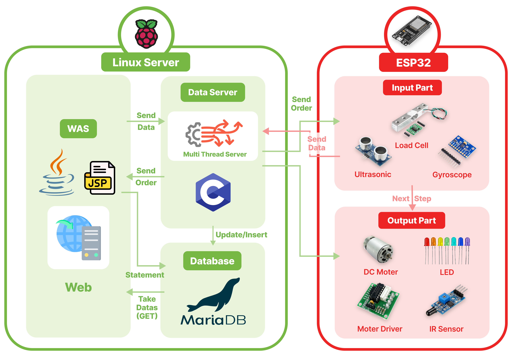
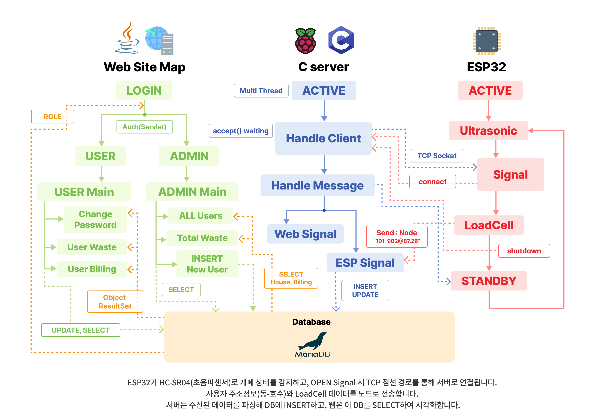
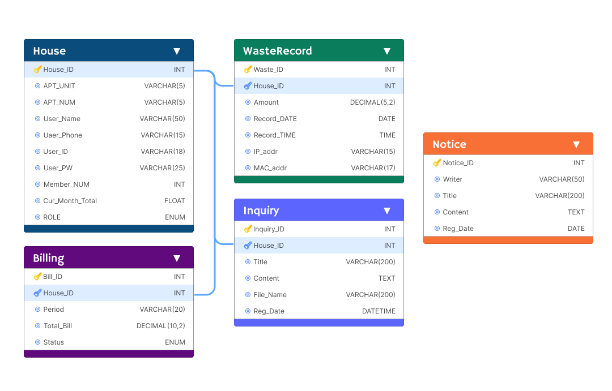

# 🗑️ 비워요! 스마트클린 (SmartClean)
 

 

> **IoT + TCP/IP 기반 스마트 음식물 쓰레기 관리 시스템** 입니다.  
> IR센서에 반응하여 사용자의 움직임을 감지하고, 모터제어를 통해 자동으로 개폐되어 편의성을 증진시켰습니다.  
> 음식물 배출 데이터를 실시간으로 측정·기록하고, 웹을 통해 투명하고 공정한 관리비 산정을 지원합니다.  

   

## 📅 프로젝트 개요

| 항목 | 내용 |
|------|------|
| **프로젝트명** | 비워요! 스마트클린 |
| **수행기간** | 2025.09 ~ 2025.10 |
| **참여인원** | 고서연, 구아인, 조정근 |
| **주요역할** | Web(JSP) + Linux Server + ESP32 IoT 기기 통합 구현 |
| **목표** | IoT와 무선 네트워크(TCP/IP) 기반 융복합 플랫폼 구축으로 사용자 편의성 극대화 |

   

## ⚙️ 사용 기술

| 구분 | 기술 및 환경 |
|------|---------------|
| **IoT Device** | ESP32, DC Motor, LED, IR Sensor, Ultrasonic Sensor, Load Cell (HX711) |
| **Platform Server** | Debian Linux 12 (bookworm), TCP/IP (C언어) |
| **Web Application** | Java 8 (JDK 1.8), Apache Tomcat 10.1, JSP |
| **Database** | MariaDB 10.11 |
| **Frontend** | Chart.js (데이터 시각화) |

   

## 🎯 프로젝트 목표

- 음식물 쓰레기 배출량을 **자동으로 측정·기록**
- 데이터를 기반으로 **공정한 관리비 산정 및 효율적인 자원 관리 실현**
- 웹을 통한 **실시간 데이터 확인 및 시각화**

   

## 🧩 시스템 구성도

ESP32 → Linux Server → MariaDB → JSP(Web)

- **ESP32**: 센서 데이터 수집 및 송신  
- **Server**: TCP/IP 통신 수신 및 DB 저장  
- **Web**: 사용자/관리자용 시각화 및 CRUD 관리

   

## 🔄 전체 동작 플로우

1. ESP32가 초음파 센서로 뚜껑 열림 상태 감지  
2. 일정 시간 후 로드셀로 음식물 무게 측정  
3. 측정 데이터(` 세대ID @ 배출량 `)를 LinkedList 자료구조 형태로 Linux 서버에 전송  
4. Linux Server와 Client는 TCP/IP를 통해 통신 후 데이터 파싱 및 DB Insert  
5. Billing 테이블에서 세대별 청구금액 자동 업데이트  
6. JSP 웹페이지에서 DB 조회 → 실시간 시각화 및 CRUD 기능 제공

   

## 🧠 주요 파트별 상세 설명

### Linux Server (C언어 기반)

- `accept()` 루프를 통해 다수의 ESP32 클라이언트 연결 대기  
- 수신된 데이터(`ID@value`)를 파싱 후 DB에 Insert  
- Linked List 자료구조를 구현해 세대별 데이터 효율 관리  
- Billing 테이블(Total_Bill, 청구금액) 자동 업데이트
  

### ESP32 (Client)

- `WiFi.h` 라이브러리를 이용해 Server와 TCP/IP 연결 후 데이터 송신  
- HX711로 음식물 무게 측정, HC-SR04로 뚜껑 OPEN/CLOSE 상태 감지  
- OPEN 상태가 2초 이상 지속되면 5회 평균값 서버 전송  
- 송신 완료 후 `shutdown()` → `close()`로 연결 종료
  

### Web (JSP + Tomcat)

- 사용자 로그인 시 `Session`으로 권한(Role) 관리  
- CRUD 기능 구현
  - **Create**: 관리자 신규 세대 등록  
  - **Read**: 일별·월별 폐기량 및 요금 조회  
  - **Update**: 사용자 정보 및 비밀번호 수정  
  - **Delete**: 관리자 전용 비활성 세대 데이터 삭제  
- Chart.js를 통해 폐기량 및 요금 변동을 시각화

   

## 🗄️ 데이터베이스 구조

| 테이블명 | 설명 |
|-----------|------|
| **House** | 세대 정보 (ID, 이름, 주소 등) |
| **WasteRecord** | 날짜별 배출 내역 기록 |
| **Billing** | 청구 금액 및 납부 현황 관리 |
| **Notice** | 공지사항 게시판 (제목, 내용, 작성자, 등록일 등) |
| **Inquiry** | 1:1 문의 게시판 (작성자, 문의내용, 답변상태 등) |

> 모든 테이블은 **House_ID**를 외래키(Foreign Key)로 공유합니다. 
> Notice와 Inquiry 테이블은 **ROLE(관리자/사용자)** 접근 권한에 따라 구분 표시됩니다.

   

## 🖼️ UI 미리보기

|  |  |
|------------------------------------------|---------------------------------------------|
| 로그인 화면 | 메인 대시보드 |
|  |  |
| 일별/월별 배출 내역 | 세대별 청구 내역 |
|  |  |
| 공지사항 | 1:1 문의 |
|  |  |
| 공지사항 작성 | 공지사항 수정 |
|  |  |
| 신규 세대 등록 | Chart.js 통계 시각화 |

 

|  |  |  |
|---------------------------------------------|---------------------------------------------|---------------------------------------------|
| 모바일 로그인 | 모바일 메인 대시보드 | 배출 내역 조회 |

    

## 📚 개발 관리 및 문의

| 구분 | 링크 |
|------|------|
| **GitHub Repository** | https://github.com/woogwayeon/ESP32_PROJ_2025-SmartClean |
| **개발 문서 관리** | https://docs.google.com/document/d/e/2PACX-1vRxjcA6kQyuZDT82PdVcreavuCDWfHQ5tX1u9FsmwcUdFCC4Syxoof0yQPlA2-Xc9SLnSEmZZVWgXvk/pub |
| **고서연** | woogwayeon@gmail.com |
| **구아인** | gooaine123@gmail.com |
| **조정근** | zmsdkdl98@gmail.com |

   

## 🧾 License

© 2025. woogwayeon. All Rights Reserved.

